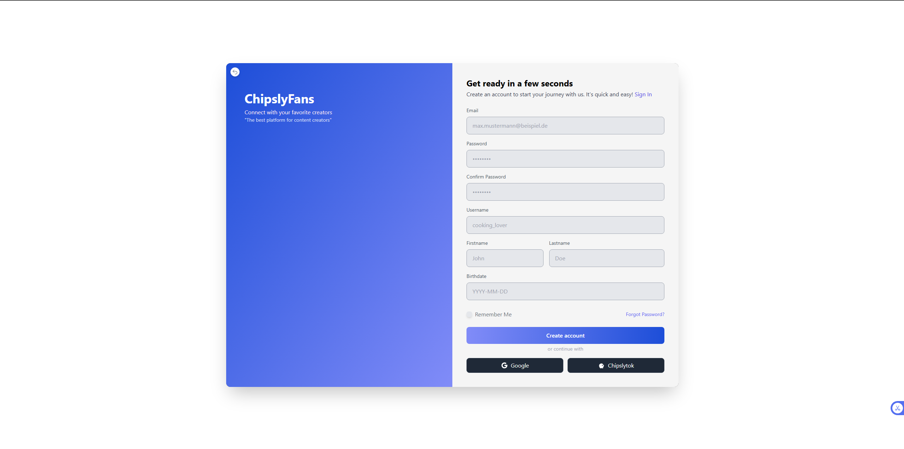
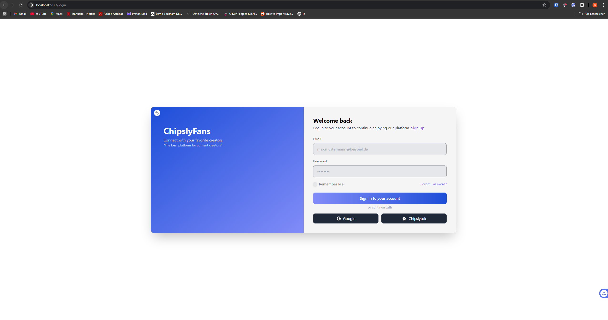
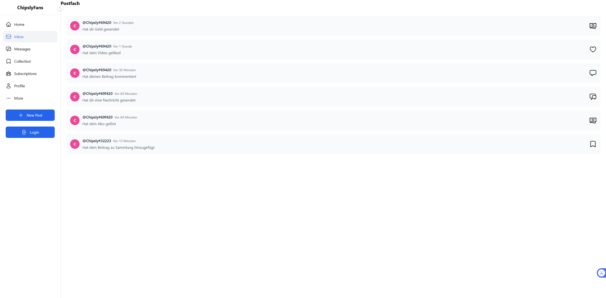

# Statusbericht 1 - Chipslyfans IPT6.1

## Aktueller Projektstatus

Der aktuelle Stand des Projekts lässt sich wie folgt zusammenfassen:

1. **Dokumentation**: Projektziel, Zeitplan und Anforderungsanalyse sind zu 100% abgeschlossen.
2. **Backend-Entwicklung**: 
   - Benutzer- und Post-Verwaltung zu 80% fertiggestellt
   - Registrierungs- und Login-Funktionalität vollständig implementiert
   - Authentifizierung via JWT (JSON Web Tokens) funktioniert
   - Datenbankstruktur für User und Posts zu 90% fertig (weitere Anpassungen geplant)
3. **Frontend-Entwicklung**:
   - Grundlegende Views (Login, Registrierung, Home) zu 70% implementiert
   - HomeView kann bereits Posts laden
   - NotificationsView im Frontend angelegt

Der Projektfortschritt entspricht insgesamt etwa 75% des geplanten Zeitrahmens.

## Abweichungen vom Plan

Es gibt derzeit keine gravierenden Abweichungen vom Projektplan. Die Entwicklung verläuft gemäß den ursprünglichen Zeitvorgaben.

## Technische Details

### a. Frontend-Status
Das Frontend ist grundlegend funktionsfähig und mit dem Backend verbunden. Die Hauptkomponenten (Login, Registrierung, Home-Feed) sind implementiert, jedoch werden weitere Verbesserungen am Design und zusätzliche Funktionen folgen.

### b. Backend- und Datenbank-Status
- **Backend-Technologie**: Node.js mit Express.js
- **Datenbank**: MariaDB (relationales Datenbankmanagementsystem)
- **Aktueller Funktionsumfang**:
  - Funktionierende Benutzerauthentifizierung (Login/Registrierung)
  - Post-Erstellung und -Verwaltung
  - Home-Feed mit Post-Ladefunktionalität

### c. Mehrsprachigkeit
- **Frontend**: i18n Framework für Internationalisierung implementiert
- **Datenbank**: Mehrsprachige Inhalte wurden noch nicht berücksichtigt. Geplante Lösung:
  - Entweder separate Tabellen für jede Sprache
  - Oder JSON-Felder für mehrsprachige Inhalte in bestehenden Tabellen
  - Entscheidung folgt nach weiterer Evaluation

### d. Hosting-Status
Das Backend läuft derzeit lokal im Entwicklungsumfeld. Erste Funktionstests wurden erfolgreich durchgeführt. Die Migration auf den Produktionsserver ist für die nächste Phase geplant.

## Visuelle Dokumentation

- LoginView: 

- RegisterView: 

- Home-Feed: Home-Feed mit Beispiel-Posts

